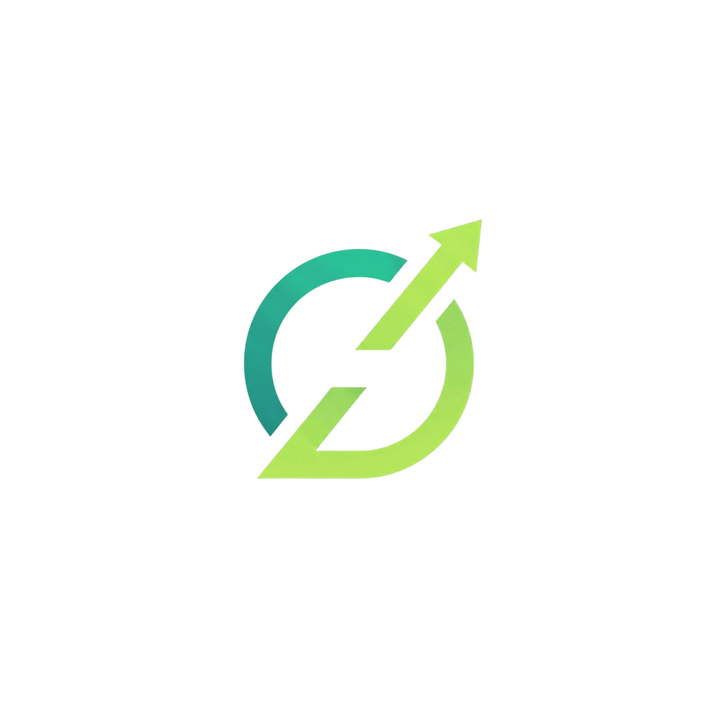
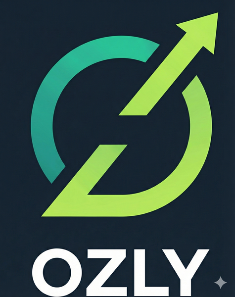

<div class="cover">
  <div class="cover-logo">
    
    <p class="cover-wordmark">OZLY</p>
    <p class="cover-tagline">SHIFTS · INVOICES · TAXES</p>
  </div>
  <div class="cover-middle">
    <h1 class="cover-title">Brand Guide &amp;<br/>Marketing Handoff</h1>
    <p class="cover-subtitle">Documento consolidado para CMO e consultoria de marketing — identidade visual, tom de voz, produto, canais e roadmap dos próximos 90 dias.</p>
  </div>
  <div class="cover-meta">
    <div>
      <strong>Versão</strong>
      1.1 — 2026-05-26
    </div>
    <div>
      <strong>Mantenedor</strong>
      Augusto Oliveira · Founder
    </div>
    <div>
      <strong>Confidencialidade</strong>
      Restrito — uso interno
    </div>
  </div>
</div>

# Sumário executivo

Ozly é um app **mobile-first** para trabalhadores autônomos (ABN/TFN) na Austrália gerenciarem jobs, invoices, despesas e impostos sem precisar de contador no dia-a-dia. Está **em produção nas duas lojas** (App Store AU + Google Play) com 3 planos por assinatura (TFN, ABN, PRO). Preço de entrada equivalente a **AUD $2.88/semana** (TFN/ABN anual) ou **$14.99/mês** no plano mensal. Trial de 14 dias em todos os planos.

<div class="stat-grid">
  <div class="stat-card">
    <p class="stat-value">3</p>
    <p class="stat-label">Idiomas nativos<br/>EN · PT · ES</p>
  </div>
  <div class="stat-card">
    <p class="stat-value">2</p>
    <p class="stat-label">Stores em produção<br/>iOS + Android</p>
  </div>
  <div class="stat-card">
    <p class="stat-value">14d</p>
    <p class="stat-label">Trial grátis<br/>em todos os planos</p>
  </div>
  <div class="stat-card">
    <p class="stat-value">$2.88</p>
    <p class="stat-label">/ semana<br/>(plano anual)</p>
  </div>
  <div class="stat-card">
    <p class="stat-value">0%</p>
    <p class="stat-label">de earnings<br/>(sem comissão)</p>
  </div>
  <div class="stat-card">
    <p class="stat-value">5</p>
    <p class="stat-label">redes sociais<br/>a criar (gap)</p>
  </div>
</div>

<div class="callout callout-brand">
  <p class="callout-title">Resumo de uma linha</p>
  <p style="margin:0">App australiano, multi-idioma, focado em <strong>sole traders / ABN holders</strong>, com sub-segmento de alta conversão em <strong>migrantes LATAM</strong> na AU. Produto sólido, presença social a construir.</p>
</div>

<div class="callout callout-warn">
  <p class="callout-title">Gap crítico identificado</p>
  <p style="margin:0"><strong>Zero presença social oficial.</strong> Instagram, TikTok, Facebook, LinkedIn e canal YouTube formal ainda não existem. Esta é a primeira frente de trabalho prioritária pra consultoria.</p>
</div>

---

# 1. Identidade da marca

<div class="section-band"></div>

## 1.1 Nome e wordmark

- **Nome formal:** Ozly (capitalização padrão de marca em texto corrido)
- **Wordmark:** "OZLY" — sempre **all caps**, fonte **Montserrat Bold/Black**
- **Pronúncia:** /ˈɒz.li/ ("ózli")
- **Origem:** referência a "Oz" (apelido informal da Austrália) + sufixo "-ly" (smoothly, quickly)
- **❌ Não usar:** ~~oz·ly~~ (versão antiga com ponto, depreciada)

<div style="text-align:center; background: var(--navy); border-radius: 8px; padding: 2em 1em; margin: 1em 0;">
  
</div>

## 1.2 Paleta de cores — fonte de verdade

### Core da marca

<div class="swatch-grid">
  <div class="swatch">
    <div class="swatch-block" style="background:#2BBB97;"></div>
    <p class="swatch-name">Ocean Teal</p>
    <p class="swatch-hex">#2BBB97</p>
    <p class="swatch-use">Accent primária. CTAs, ícones, links.</p>
  </div>
  <div class="swatch">
    <div class="swatch-block" style="background:#162431;"></div>
    <p class="swatch-name">Midnight Navy</p>
    <p class="swatch-hex">#162431</p>
    <p class="swatch-use">Background principal (dark theme).</p>
  </div>
  <div class="swatch">
    <div class="swatch-block" style="background:#9DD760;"></div>
    <p class="swatch-name">Electric Lime</p>
    <p class="swatch-hex">#9DD760</p>
    <p class="swatch-use">Accent secundária. Highlights, sucesso, energia.</p>
  </div>
  <div class="swatch">
    <div class="swatch-block" style="background:#F8FAFC; border: 1px solid #CBD5E1;"></div>
    <p class="swatch-name">Off-White</p>
    <p class="swatch-hex">#F8FAFC</p>
    <p class="swatch-use">Texto em dark, background light.</p>
  </div>
</div>

### Superfície & texto (WCAG AA validado)

<div class="swatch-grid">
  <div class="swatch">
    <div class="swatch-block" style="background:#1E293B;"></div>
    <p class="swatch-name">Deep Steel</p>
    <p class="swatch-hex">#1E293B</p>
    <p class="swatch-use">Cards em dark theme.</p>
  </div>
  <div class="swatch">
    <div class="swatch-block" style="background:#334155;"></div>
    <p class="swatch-name">Slate 700</p>
    <p class="swatch-hex">#334155</p>
    <p class="swatch-use">Bordas, elevação.</p>
  </div>
  <div class="swatch">
    <div class="swatch-block" style="background:#CBD5E1;"></div>
    <p class="swatch-name">Sky Grey</p>
    <p class="swatch-hex">#CBD5E1</p>
    <p class="swatch-use">Texto secundário.</p>
  </div>
  <div class="swatch">
    <div class="swatch-block" style="background:#64748B;"></div>
    <p class="swatch-name">Hint Grey</p>
    <p class="swatch-hex">#64748B</p>
    <p class="swatch-use">Disabled / placeholder.</p>
  </div>
</div>

### Status & feedback

<div class="swatch-grid">
  <div class="swatch">
    <div class="swatch-block" style="background:#4CAF50;"></div>
    <p class="swatch-name">Success Green</p>
    <p class="swatch-hex">#4CAF50</p>
    <p class="swatch-use">Pago, confirmado.</p>
  </div>
  <div class="swatch">
    <div class="swatch-block" style="background:#FFA726;"></div>
    <p class="swatch-name">Warning Amber</p>
    <p class="swatch-hex">#FFA726</p>
    <p class="swatch-use">Pendente.</p>
  </div>
  <div class="swatch">
    <div class="swatch-block" style="background:#FF8C00;"></div>
    <p class="swatch-name">Overdue Orange</p>
    <p class="swatch-hex">#FF8C00</p>
    <p class="swatch-use">Atrasado.</p>
  </div>
  <div class="swatch">
    <div class="swatch-block" style="background:#EF5350;"></div>
    <p class="swatch-name">Error Red</p>
    <p class="swatch-hex">#EF5350</p>
    <p class="swatch-use">Erro.</p>
  </div>
</div>

### Premium tier (Legend — gamificação)

<div class="swatch-grid">
  <div class="swatch">
    <div class="swatch-block" style="background:#111111;"></div>
    <p class="swatch-name">Matte Black</p>
    <p class="swatch-hex">#111111</p>
    <p class="swatch-use">Tier Legend background.</p>
  </div>
  <div class="swatch">
    <div class="swatch-block" style="background:#D4AF37;"></div>
    <p class="swatch-name">Deep Gold</p>
    <p class="swatch-hex">#D4AF37</p>
    <p class="swatch-use">Tier Legend accent.</p>
  </div>
  <div class="swatch">
    <div class="swatch-block" style="background:#E5E4E2;"></div>
    <p class="swatch-name">Platinum Silver</p>
    <p class="swatch-hex">#E5E4E2</p>
    <p class="swatch-use">Tier intermediário.</p>
  </div>
  <div class="swatch">
    <div class="swatch-block" style="background: linear-gradient(135deg, #162431 0%, #1C3040 100%);"></div>
    <p class="swatch-name">Hero Gradient</p>
    <p class="swatch-hex">#162431 → #1C3040</p>
    <p class="swatch-use">Top-left → bottom-right.</p>
  </div>
</div>

## 1.3 Tipografia

| Função | Fonte | Notas |
|---|---|---|
| Wordmark e headlines | **Montserrat** (Bold/Black) | All caps no wordmark |
| UI e body | **Inter** (Regular/Medium/Semibold) | Sistema de design do app |
| Fallback web | Segoe UI, Roboto, system-ui | Para máquinas sem Google Fonts |
| Código (raro) | SF Mono, Menlo, Consolas | Apenas em docs técnicos |

Ambas as fontes estão no Google Fonts (gratuitas, comerciais OK).

---

# 2. Tom de voz

<div class="section-band"></div>

## 2.1 Os 5 atributos do tone

1. **Direto** — sem rodeio, sem corporativês. Uma ideia por linha.
2. **Aussie-friendly** — "mate", "no worries", "G'day" quando faz sentido. Sem forçar.
3. **Pragmático** — fala em dinheiro, tempo, dor real. Não vende sonho.
4. **Empático com migrante** — reconhece que o sistema AU é confuso em outra língua. Sem condescendência.
5. **Confiante mas humilde** — sabemos do que falamos (impostos AU), mas direcionamos pro contador quando importa.

## 2.2 Regras duras (não negociáveis)

<div class="callout callout-bad">
  <p class="callout-title">Proibido em qualquer canal de marketing</p>
  <ul style="margin:0; padding-left: 1.2em;">
    <li><strong>Sem emojis.</strong> Nem IG, nem TikTok, nem email, nem push, nem WhatsApp template, nem caption. Em nenhum canal.</li>
    <li><strong>Sem "sub-contractor" / "subcontratista"</strong> em marketing — soa frio. Eles se descrevem como "tradie", "autônomo", "self-employed".</li>
    <li>Sem "plataforma", "solução completa", "empoderamento", "revolucionário".</li>
    <li>Sem ALL CAPS pra urgência ("ÚLTIMOS 3 DIAS!!!").</li>
    <li>Sem escassez falsa ("apenas 5 vagas") se não for verdade.</li>
    <li>Sem hashtags genéricas (#business #entrepreneur). Usar nichado: #tradie #abn #soletrader #sidehustle #brasileirosnaaustralia.</li>
  </ul>
</div>

## 2.3 DO &amp; DON'T

<div class="do-dont">
  <div class="col do">
    <h4>✓ Things we say</h4>
    <ul>
      <li><strong>EN:</strong> tradie, sole trader, self-employed, mate, G'day, ABN, TFN, BAS lodgement</li>
      <li><strong>PT:</strong> autônomo, trabalhador, ABN, "sem dor de cabeça", pessoal, "toca seu negócio sozinho"</li>
      <li><strong>ES:</strong> trabajador independiente, autónomo, "sin dolor de cabeza", compa/che, "manejas tu propio negocio"</li>
      <li>Sempre que possível, falar do ofício direto: encanador, pintor, plumber, fontanero</li>
      <li>Números reais: "$14.99 AUD/mês"</li>
      <li>Frase curta, um conceito por linha</li>
    </ul>
  </div>
  <div class="col dont">
    <h4>✗ Things we don't say</h4>
    <ul>
      <li>"Solução completa" / "All-in-one solution" — vazio</li>
      <li>"Empoderamento" / "Empowerment" — corporativo</li>
      <li>"Revolucionário" / "Revolutionary" — exagero</li>
      <li>"Plataforma" — usa "app"</li>
      <li>"Usuário" em marketing — usa "você"</li>
      <li>Linguagem jurídica desnecessária</li>
      <li>"Preço acessível" — usa o número</li>
      <li>Hashtags genéricas (#business)</li>
    </ul>
  </div>
</div>

## 2.4 Idiomas suportados

| Código | Variante | Notas culturais |
|---|---|---|
| EN | Australian | "colour" não "color", "mate" não "buddy" |
| PT-BR | Brasileiro | Não Portugal |
| ES | LATAM neutro | "ustedes" (não "vosotros") |

Detecção automática por idioma do device/browser. Marketing **adapta**, não traduz word-for-word.

## 2.5 Exemplos canônicos de copy aprovada (Instagram caption)

**PT — pain-point direto**
```
Você é autônomo e ainda calcula imposto na calculadora?

Ozly faz isso pra você.
GST, BAS, deductions — tudo automático.
Sem planilha. Sem dor de cabeça.

Baixa grátis. Link na bio.

#autonomo #abn #australia #brasileirosnaaustralia #trabalhoaustralia
```

**EN — Aussie casual**
```
G'day, mate.

Tracking jobs, invoices and BAS on a notebook?
There's a faster way.

Ozly does it for you. Sole trader friendly.
AUD priced. No accountant required for the day-to-day.

Free to start. Link in bio.

#tradie #soletrader #abn #australia #smallbusiness
```

**ES — LATAM migrant empathy**
```
¿Trabajas con ABN en Australia y todavía pierdes horas con planillas?

Ozly maneja jobs, gastos y BAS por ti.
En español, dólares australianos, sin complicaciones.

Empieza gratis. Link en la bio.

#australia #latinosenAustralia #autonomo #abn
```

## 2.6 Hooks de TikTok / YouTube Shorts (3 primeiros segundos)

1. **EN** — "Mate, you're a sole trader and you're still doing tax on a calculator?"
2. **PT** — "Você é autônomo na Austrália e ainda usa planilha?"
3. **ES** — "¿Trabajas con ABN y no sabes cuánto guardar para el BAS?"
4. **EN** — "Three things every Aussie tradie hates: paperwork, paperwork, and paperwork."
5. **PT** — "Como brasileiro autônomo aqui na Austrália gasta 4 horas por mês com imposto. Eu gasto 4 minutos."

**Estrutura padrão Shorts:**
1. Hook (3s, texto na tela + voz)
2. Demo do app em ação (screen recording, 15-30s)
3. CTA verbal: "Baixa Ozly, link na bio" / "Get Ozly, link in bio"
4. Caption curta (uma frase + hashtags)

---

# 3. Produto e posicionamento

<div class="section-band"></div>

## 3.1 Posicionamento de uma linha (3 idiomas)

<div class="tagline-box">
  <span class="tagline-lang">EN</span>No more mess. Shifts, Invoices &amp; Taxes in one place. Built for ABN and/or TFN workers in Australia.
</div>

<div class="tagline-box">
  <span class="tagline-lang">PT</span>Sem bagunça. Jobs, invoices e impostos num app só. Feito pra autônomos ABN/TFN na Austrália.
</div>

<div class="tagline-box">
  <span class="tagline-lang">ES</span>Sin desorden. Jobs, invoices e impuestos en una sola app. Hecha para trabajadores ABN/TFN en Australia.
</div>

## 3.2 Features-chave por plano

| Feature | Plano | O que entrega |
|---|---|---|
| Shifts & Invoices | ABN + TFN | Importa do Google Calendar, gera PDF, envia por WhatsApp/email/SMS |
| Smart Camera (OCR) | ABN + TFN | Foto do recibo → categoriza → estima dedução fiscal |
| Net Salary & Penalty Rates | TFN | Bruto, retenção, líquido em tempo real + penalty rates AU |
| ABN ↔ TFN Converter | ABN + TFN | Compara contratos, projeta tax return + super |
| Reimbursements | TFN + PRO | Combustível, lavanderia, ferramentas, uniforme — PDF pro empregador |
| Visa Shield | Todos | Trava de 48h/quinzena (estudantes), evita violação de visto |
| Hustle Score | Todos | Gamificação: XP, tiers (Starter → Hustler → Pro → Legend) |
| Offline-first | Todos | Funciona sem internet, sincroniza quando volta |
| GST + BAS helper | ABN | Cálculo automático, relatório trimestral pronto |
| Multi-ABN | PRO | Quem toca mais de um negócio |
| Referral | Todos | +500 XP por amigo convertido |

## 3.3 Diferenciais vs concorrência

<div class="callout callout-brand">
  <p class="callout-title">Por que Ozly e não Xero / MYOB / QuickBooks</p>
  <ul style="margin: 0; padding-left: 1.2em;">
    <li><strong>Não é Xero/MYOB:</strong> focado em ABN/TFN solo, não em empresas com staff e contador full-time</li>
    <li><strong>Não é genérico (Toggl/QuickBooks):</strong> entende ATO, GST, BAS, Medicare, regras de visto</li>
    <li><strong>Não é app brasileiro adaptado:</strong> australiano de raiz com multi-idioma nativo desde dia 1</li>
    <li><strong>Sem taxa por invoice, sem % do faturamento</strong> — preço fixo</li>
    <li><strong>OCR com IA</strong> (Google Gemini) — não exige digitação manual de recibos</li>
    <li><strong>Funciona 100% offline</strong> — tradies em obra sem sinal não travam</li>
  </ul>
</div>

---

# 4. Pricing &amp; unit economics

<div class="section-band"></div>

## 4.1 Planos (em AUD, IAP-only)

Dois ciclos de cobrança por plano: **mensal** (preço cheio) ou **anual** (com desconto, exibido como equivalente semanal no marketing).

| Plano | Para quem | Mensal | Anual | Equiv. semanal (anual) | Equiv. mensal (anual) |
|---|---|---|---|---|---|
| **TFN** | Trabalhadores com TFN (salário, shifts, PAYG, Medicare) | **$14.99/mês** | **$149.99/ano** | $2.88/sem | $12.50/mês |
| **ABN** | Sole traders com ABN (invoices, GST, BAS) | **$14.99/mês** | **$149.99/ano** | $2.88/sem | $12.50/mês |
| **PRO** | Quem tem ambos (toggle TFN ↔ ABN no app) | **$19.99/mês** | **$199.99/ano** | $3.85/sem | $16.67/mês |

**Desconto do anual vs mensal:** ~17% off em todos os planos.

<div class="callout callout-good">
  <p class="callout-title">Regras gerais do pricing</p>
  <ul style="margin:0; padding-left: 1.2em;">
    <li><strong>Trial:</strong> 14 dias grátis em todos os planos (cobrança automática ao fim do trial)</li>
    <li><strong>Sem cobrança per-invoice, sem % sobre earnings</strong> (diferencial vs concorrência)</li>
    <li><strong>Apple Small Business Program ativo</strong> — Apple cobra 15% (não 30%) das vendas iOS</li>
    <li><strong>Apenas IAP</strong> — sem cobrança fora das lojas (Stripe/PayPal não habilitados)</li>
    <li>Cancelamento via App Store / Play Store (padrão das stores)</li>
  </ul>
</div>

## 4.2 Stack de monetização

- **RevenueCat** centraliza iOS + Android — gerencia trial, entitlements, win-back, refund tracking
- **Apple Search Ads** já operacional como canal de aquisição pago
- Receipts ~20KB por transação (relevante pra observabilidade/billing)

---

# 5. Audiência

<div class="section-band"></div>

## 5.1 Primária — Australian sole traders / ABN holders

<table>
  <thead>
    <tr><th>Dimensão</th><th>Perfil</th></tr>
  </thead>
  <tbody>
    <tr><td><strong>Idade</strong></td><td>25–55 anos</td></tr>
    <tr><td><strong>Ofícios típicos</strong></td><td>Plumber, electrician, painter, landscaper, cleaner, delivery driver, freelance, qualquer ABN solo</td></tr>
    <tr><td><strong>Dores principais</strong></td><td>Papelada de impostos, controle de jobs, recebimentos atrasados, GST, BAS trimestral</td></tr>
    <tr><td><strong>Comportamento mobile</strong></td><td>App-first (não usa desktop), faz tudo no celular entre jobs</td></tr>
    <tr><td><strong>Canais de descoberta</strong></td><td>Indicação, comunidades de tradies, Instagram/TikTok, Apple Search Ads</td></tr>
  </tbody>
</table>

## 5.2 Sub-segmento de alta conversão — LATAM migrants

<table>
  <thead>
    <tr><th>Dimensão</th><th>Perfil</th></tr>
  </thead>
  <tbody>
    <tr><td><strong>Origens</strong></td><td>Brasil, Argentina, Colômbia, México, Venezuela, Chile</td></tr>
    <tr><td><strong>Idiomas-alvo</strong></td><td>PT-BR + ES</td></tr>
    <tr><td><strong>Dor extra</strong></td><td>Vocabulário fiscal australiano em outra língua, sentir-se perdido no sistema AU</td></tr>
    <tr><td><strong>Vetor de aquisição</strong></td><td>Boca-a-boca em comunidades fechadas (grupos WhatsApp/Telegram, igrejas, eventos comunitários)</td></tr>
    <tr><td><strong>Conversão observada</strong></td><td>Mais alta que média do app geral</td></tr>
  </tbody>
</table>

## 5.3 Não é nossa audiência

<div class="callout callout-bad">
  <p class="callout-title">Excluir destas campanhas</p>
  <ul style="margin: 0; padding-left: 1.2em;">
    <li>Empregados CLT/W2 puros (sem ABN)</li>
    <li>Empresas com mais de 10 funcionários (Xero/MYOB land)</li>
    <li>Quem já usa Xero/MYOB pesadão (ABN solo)</li>
    <li>Mercado fora da Austrália</li>
  </ul>
</div>

---

# 6. Canais digitais (o que existe hoje)

<div class="section-band"></div>

## 6.1 Site institucional

- **Domínio:** ozly.au
- **Stack:** React + Vite, deploy via Cloudflare Worker
- **Score SEO Ubersuggest:** 90/100

**Rotas vivas:**

| Rota | Função |
|---|---|
| `/` | Home (hero, audiência, real earnings, features, comparison, pricing, FAQ) |
| `/guide` | Onboarding multilíngue PT/EN/ES com vídeos YouTube Shorts |
| `/support` | Página de suporte |
| `/privacy-policy` | APP-compliant, OAIC mencionado |
| `/terms-of-use` | Termos de uso |
| `/affiliate-apply`, `/affiliate-dashboard`, `/affiliate-auth` | Fluxo de programa de afiliados |
| `/referral-landing` | Landing pra deep-link de referral |

## 6.2 App Stores

| Loja | URL | Bundle ID | App ID |
|---|---|---|---|
| Apple App Store (AU) | apps.apple.com/au/app/ozly/id6760398649 | `com.augusto.ozly` | 6760398649 |
| Google Play (global) | play.google.com/store/apps/details?id=com.augusto.ozly | `com.augusto.ozly` | — |

**Build atual:** 1.4.1+414 (Flutter)

## 6.3 Email institucional

| Endereço | Uso | SLA |
|---|---|---|
| **contact@ozly.com.au** | Footer do site, contato geral / sales | 1-2 dias úteis |
| **support@ozly.com.au** | Suporte de produto | 1-2 dias úteis |
| **privacy@ozly.com.au** | Privacidade, deletion requests (APP compliance) | 30 dias por lei |

## 6.4 Vídeo (YouTube Shorts já produzidos)

Vídeos linkados no Guide multilíngue do site:

- Como criar uma conta / Configuração inicial
- Como usar o Dashboard
- Menu lateral
- Criar novo trabalho
- Criar Timesheet

<div class="callout callout-warn">
  <p class="callout-title">Gap atual</p>
  <p style="margin:0">Não há <strong>canal YouTube formal</strong> estruturado — só os Shorts dispersos, embedados no site. Falta playlists por idioma, branding consistente e descrições otimizadas.</p>
</div>

## 6.5 Programa de afiliados

- **Deep-link de referral:** `ozly.au/refer/?code=XXX` (auto-aplica no signup)
- **Referrer ganha:** +500 XP (Hustle Score, dentro do app)
- **Referee ganha:** trial estendido após conversão
- Pitch oficial em PDF (PT-BR) já existe no folder `marketing/affiliate-pitch/`
- Pitch HTML editável também disponível

---

# 7. GAPS críticos — atacar primeiro

<div class="section-band"></div>

Os pontos abaixo **não existem ainda** ou estão incompletos. São o trabalho imediato pra consultoria.

## 7.1 Redes sociais — zero presença oficial

<table>
  <thead>
    <tr><th>Canal</th><th>Status</th><th>Ação recomendada</th></tr>
  </thead>
  <tbody>
    <tr><td><strong>Instagram</strong></td><td><span class="pill pill-red">Não existe</span></td><td>Criar @ozly.au, perfil bilíngue EN/PT/ES</td></tr>
    <tr><td><strong>TikTok</strong></td><td><span class="pill pill-red">Não existe</span></td><td>Criar @ozly.au, foco em Shorts já produzidos</td></tr>
    <tr><td><strong>YouTube</strong></td><td><span class="pill pill-gold">Parcial</span></td><td>Estruturar canal "Ozly AU" com playlists por idioma</td></tr>
    <tr><td><strong>Facebook</strong></td><td><span class="pill pill-red">Não existe</span></td><td>Criar página + grupos LATAM/AU</td></tr>
    <tr><td><strong>LinkedIn</strong></td><td><span class="pill pill-red">Não existe</span></td><td>Página da empresa (importante pra B2B-ish e brand authority)</td></tr>
    <tr><td><strong>WhatsApp Business</strong></td><td><span class="pill pill-gold">Templates prontos</span></td><td>Submeter 7 templates ao Meta (já redigidos no Brand Voice)</td></tr>
    <tr><td><strong>Telegram</strong></td><td><span class="pill pill-red">Sem canal</span></td><td>Avaliar canal LATAM (alta adoção entre brasileiros/venezuelanos na AU)</td></tr>
  </tbody>
</table>

<div class="callout callout-warn">
  <p class="callout-title">Quick win</p>
  <p style="margin:0">O footer do site não linka nenhuma rede social. Quando criar os perfis, adicionar ícones de IG/TikTok/YouTube/FB/LinkedIn no footer — é uma melhoria de 30 minutos com impacto imediato em descoberta.</p>
</div>

## 7.2 Analytics e atribuição

| Ferramenta | Status atual | Ação |
|---|---|---|
| Apple Search Ads | <span class="pill pill-teal">Operacional</span> | OK — manter, expandir budget se ROAS positivo |
| Google Analytics 4 | <span class="pill pill-red">Não instalado</span> | Instalar GA4 + GTM no site |
| Meta Pixel | <span class="pill pill-red">Não instalado</span> | Instalar quando IG/FB ads ligarem |
| TikTok Pixel | <span class="pill pill-red">Não instalado</span> | Instalar quando TikTok ads ligarem |
| Sentry | <span class="pill pill-teal">Operacional</span> | Observabilidade do app (não-marketing) |

## 7.3 Email marketing e CRM

- **Resend** já configurado pra transacionais (welcome, trial-ending, payment-failed)
- ❌ **Sem ferramenta de campaign / newsletter** (Mailchimp, ConvertKit, Loops, Customer.io)
- ❌ **Sem segmentação por tier/idioma/cohort** pra blast
- **Templates de email já redigidos** no Brand Voice (welcome, trial-ending, win-back) — falta orquestrar

## 7.4 Ads pagos

| Canal | Status | Próximo passo |
|---|---|---|
| Apple Search Ads | <span class="pill pill-teal">Rodando</span> | Otimizar keywords, expandir share |
| Google Ads | <span class="pill pill-red">Off</span> | Avaliar SEM em termos como "ABN tax app", "tradie invoice" |
| Meta Ads (IG/FB) | <span class="pill pill-red">Off</span> | Ligar após perfis criados |
| TikTok Ads | <span class="pill pill-red">Off</span> | Ligar após perfil + 4 posts orgânicos |

## 7.5 Conteúdo

- ❌ **Sem blog** no site
- ❌ **Sem SEO de long-tail** (artigos tipo "How to lodge BAS as a sole trader", "Como abrir ABN sendo brasileiro na Austrália")
- ✅ **SEO técnico do site OK** — score Ubersuggest 90
- ⚠️ **Guide multilíngue existe** mas não está sendo capitalizado como funil de conteúdo

## 7.6 App Store Optimization (ASO)

- ✅ Tagline definida ("No more mess. Shifts, Invoices &amp; Taxes in one place.")
- ⚠️ **Screenshots/keywords ASO** não documentados publicamente — precisam ser auditados via App Store Connect + Play Console
- ❌ Sem testes A/B de listing rodando

---

# 8. Infra que JÁ está pronta

<div class="section-band"></div>

## 8.1 Stack tecnológica

| Camada | Tecnologia | Status |
|---|---|---|
| App mobile | Flutter (iOS + Android) | <span class="pill pill-teal">Produção</span> |
| Backend | Supabase (auth, RLS, storage) | <span class="pill pill-teal">Produção</span> |
| Pagamentos | RevenueCat (iOS + Android) | <span class="pill pill-teal">Produção</span> |
| OCR | Google Gemini + ML Kit | <span class="pill pill-teal">Produção</span> |
| Calendário | Google Calendar API | <span class="pill pill-teal">Produção</span> |
| Crash/errors | Sentry | <span class="pill pill-teal">Produção</span> |
| Backup & DR | AWS Sydney (S3 + IAM) | <span class="pill pill-teal">Produção</span> |
| Transacionais email | Resend | <span class="pill pill-teal">Produção</span> |
| SEO técnico | Cloudflare Worker + sitemap | <span class="pill pill-teal">Produção</span> |

## 8.2 Compliance e residência de dados

- **Privacy Policy:** vivo em ozly.au/privacy-policy, APP-compliant
- **Terms of Use:** vivo em ozly.au/terms-of-use
- **Australian Privacy Act 1988 (Cth):** coberto
- **OAIC complaint path:** documentado
- **Account deletion:** in-app + email privacy@ozly.com.au
- **Data residency:** Supabase + AWS Sydney (tudo em AU)
- **Encryption at rest:** SQLCipher (local), Supabase encryption (cloud)
- **ATO retention:** 5 anos (compliance backup architecture pronto)

---

# 9. Backlog imediato (proposta de 90 dias)

<div class="section-band"></div>

## Mês 1 — Fundação social + analytics

1. Criar perfis: **Instagram, TikTok, YouTube (canal), Facebook, LinkedIn** — handles `@ozly.au` (ou variação disponível)
2. Adicionar ícones sociais no **footer do site** (`ozly.au`)
3. Instalar **GA4 + Google Tag Manager** no site
4. Estruturar **canal YouTube** com 3 playlists (EN, PT, ES) consolidando Shorts já produzidos
5. Submeter os **7 templates WhatsApp** à aprovação Meta (já redigidos no Brand Voice — categorias utility/marketing)
6. Pegar com founder: acesso a App Store Connect, Play Console, Resend (read-only pra ASO/analytics)

## Mês 2 — Conteúdo + ads pagos

7. Lançar Instagram com **12 posts iniciais** (4 PT / 4 EN / 4 ES — sem emojis, seguindo Brand Voice)
8. Produzir **8 novos TikTok/Shorts** (hooks já estão neste doc, seção 2.6)
9. Ligar **Meta Ads + TikTok Ads** em modo teste (orçamento controlado, CPI alvo a definir)
10. Definir **KPIs** com founder: CPI, trial conversion %, MRR, churn por cohort, LTV:CAC

## Mês 3 — Escala + retenção

11. Abrir seção `/blog` no site, publicar **4 artigos SEO long-tail** (PT/EN)
12. Lançar **campanha de afiliados** com 10 micro-influencers LATAM-AU
13. **A/B test de listing ASO** (App Store + Play Store) — screenshots, keywords, descrição
14. Setup de **win-back automation** no Resend (template já existe no Brand Voice)

<div class="callout callout-brand">
  <p class="callout-title">North Star da consultoria</p>
  <p style="margin:0">Sair de "produto sólido, presença social zero" para "presença multicanal coerente + funil de aquisição mensurável" em 90 dias. Ozly tem o produto e a tese. Falta a máquina de marketing.</p>
</div>

---

# 10. Contatos &amp; onboarding

<div class="section-band"></div>

| Item | Detalhe |
|---|---|
| **Founder / Decision-maker** | Augusto Oliveira |
| **Email** | augusto0102@gmail.com |
| **Email institucional** | contact@ozly.com.au |
| **Comunicação preferida** | Português (PT-BR) |
| **Decisão final** | Sempre passa pelo founder até CMO ser contratado |
| **Confidencialidade** | Toda informação deste doc é restrita — não compartilhar sem autorização |

<div class="callout callout-brand">
  <p class="callout-title">Princípio operacional</p>
  <p style="margin:0">"Concreto > abstrato. Exemplos > regras." (do próprio Brand Voice). A consultoria que entregar <strong>mocks e copy aprovável</strong> em vez de slide de estratégia ganha pontos. Velocidade de iteração importa mais que volume de slides.</p>
</div>

---

<div style="margin-top: 2cm; text-align: center; color: var(--hint); font-size: 9pt;">
  <p style="margin: 0;"><strong style="color: var(--teal-dark);">OZLY</strong> · Brand Guide &amp; Marketing Handoff v1.1</p>
  <p style="margin: 0.3em 0 0 0;">© 2026 Ozly · Documento confidencial — uso interno e parceiros autorizados</p>
</div>
